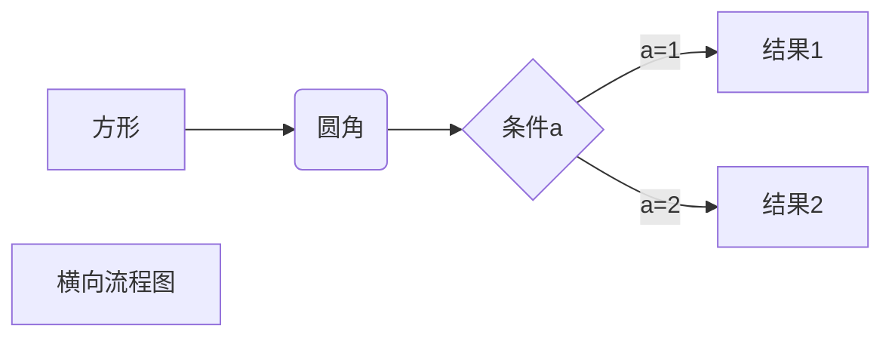
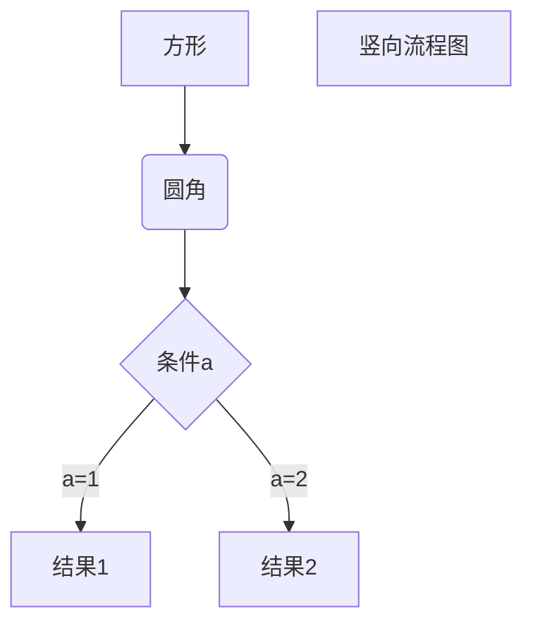

 -   欢迎来到我的主页<br>
#
- 🖥 这是我用于记录各种信息的博客。                                         
- 😄  正在寻找各种好玩的编程项目。                
- 💬  发现好玩的项目请推荐给我哦。                  
- ❤   点击下方按钮联系我的Telegram。      
  
-  [](https://t.me/az667755)

####  ***提示：点击三角图标展开内容***
---
<details>
  <summary>VPS常用命令</summary>
	最新XUI一键脚本：

```bash <(curl -Ls https://raw.githubusercontent.com/FranzKafkaYu/x-ui/master/install.sh)```

###  VPS开启root登录并且修改密码：

一键脚本

```wget -N --no-check-certificate https://github.com/taotao1058/rootvps/raw/main/rootvps && bash rootvps```


###  一键测试路由回程：

```wget -qO- git.io/besttrace | bash```


###  一键测试流媒体解锁：

```bash <(curl -L -s check.unlock.media)```

 
```bash <(curl -L -s check.unlock.media) -M 4```   # 只检测IPv4结果

 
```bash <(curl -L -s check.unlock.media) -M 6```   # 只检测IPv6结果

###  查看端口占用：

```lsof -i:端口号```

###  放行端口：

```sudo ufw allow 端口号```

```sudo ufw allow 端口号/协议```

```sudo ufw allow 起始端口:结束端口/协议```

```sudo ufw enable```   #  重启ufw防火墙

###  关闭端口：
```sudo ufw deny 端口号```

###  只允许指定IP连接22端口：
```sudo ufw allow from 192.168.1.100 to any port 22```      #  多IP用英文的逗号分开

###  文件类型转换：

```mv config.txt config.json```

```mv shell.txt shell.sh```

###  安装依赖：
 Debian/Ubuntu 命令：
 

```apt update -y``` 

```apt install curl wget git zip tar -y```


```apt-get install -y wget && apt-get install sudo```


 CentOS 命令：

```yum update -y``` 

```yum install curl wget git zip tar -y``` 

###  防火墙

```firewall-cmd --state```                             # 查看防火墙状态    


```systemctl stop firewalld.service```                 # 停止防火墙    


```systemctl disable firewalld.service```              # 禁止防火墙开机自启

###  一键开启bbr加速

```wget --no-check-certificate https://github.com/teddysun/across/raw/master/bbr.sh && chmod +x bbr.sh && ./bbr.sh```

```sysctl net.ipv4.tcp_congestion_control```          # 检查是否开启


###  查看系统内核 

```dpkg --print-architecture```


```uname -a```


###  科技lion的VPS工具箱


```curl -sS -O https://raw.githubusercontent.com/kejilion/sh/main/kejilion.sh && chmod +x kejilion.sh && ./kejilion.sh```


###  人型自走bot乌班图脚本


```wget https://raw.githubusercontent.com/TeamPGM/PagerMaid-Pyro/development/utils/install.sh -O install.sh && chmod +x install.sh && bash install.sh```


使用该脚本会将 ```Pagermaid-Pyro``` 安装至 ```/var/lib/pagermaid``` 目录下。


###  Hiddify面板(仅适用于乌班图系统)

```sudo apt update&&sudo apt install -y curl&& sudo bash -c "$(curl -Lfo- https://raw.githubusercontent.com/hiddify/hiddify-config/main/common/download_install.sh)"```


###  查看电脑wifi密码CMD命令

```netsh wlan show profile```


```netsh wlan export profile folder=C:\ key=clear```


</details>

---

<details>
  <summary>国内VPS使用代理教程</summary>
  #  国内VPS使用代理的方法，适用于无法拉取github项目

###  方法一：

首先你需要有一个可以直连的代理，建议用外国服务器安装xui面板自建

直接开启SK5代理：```export all_proxy="socks5://用户名:密码@地址:端口"```

或者开启http代理：```export all_proxy="http://用户名:密码@地址:端口"```

此时输入```curl ip.sb```查看本机IP判断是否配置成功


###  方法二：
安装shadowsocks-libev：

```sudo apt install shadowsocks-libev```  &nbsp;&nbsp;&nbsp;&nbsp;  #  Debian/Ubuntu

```sudo yum install shadowsocks-libev```  &nbsp;&nbsp;&nbsp;&nbsp;  #  CentOS


创建一个名为```config.json```的文件配置SS节点的相关信息，建议使用aes-256-gcm或aes-128-gcm等加密算法，将以下配置添加到文件中：
```
{
  "server": "节点地址",
  "server_port": 端口,
  "local_port": 1080,
  "password": "密码",
  "method": "加密算法"
}
```


使用以下命令启动shadowsocks-libev客户端：

```ss-local -c 节点文件路径 > /dev/null 2>&1 &```

然后就可以开启代理了：

```export all_proxy="socks5://127.0.0.1:1080"```


此时输入```curl ip.sb```查看本机IP判断是否配置成功

关闭终端重新连接后会自动关闭代理，重新开启SK5代理即可


也可以只用代理下载文件：

```curl --socks5 127.0.0.1:1080 http://www.example.com```


#  PS

文件格式转换命令```mv config.txt config.json```

你也可以通过编辑```/etc/shadowsocks-libev/config.json```文件来配置SS服务端:

就是把这台服务器当节点用，需要把第一行```server```配置改为```"server":"0.0.0.0",``` &nbsp;&nbsp;&nbsp;&nbsp;&nbsp;&nbsp;&nbsp;&nbsp;&nbsp;&nbsp;#  允许所有IP连接

配置完成后需重启 ```sudo systemctl restart shadowsocks-libev```

为什么用SS呢？因为apt yum pip包管理器里都内置了这些，直接安装，不用下载。


</details>

---


<details>
  <summary>无人直播推流脚本</summary>


### 利用GPT写的无人直播FFmpeg推流脚本


### 一键脚本（ubuntu系统）

请创建文件夹并放入需要推流的mp4视频


```screen -S myabc```     #创建一个窗口会话


```curl -sL -o /root/tao.sh https://raw.githubusercontent.com/taotao1058/zhibo/main/tao.sh && chmod 755 /root/tao.sh && /root/tao.sh```

推流成功


然后新开一个终端窗口输入以下命令保持后台运行

```screen -ls```       #查看窗口会话


```screen -d 1728.myabc```     #其中进程ID照你自己的填


如果需要停止 ```screen -X -S 1728.myabc quit```       #关闭该窗口会话


#


#

###  CentOS 7 一键脚本


```curl -sL -o /root/tao.sh https://raw.githubusercontent.com/taotao1058/zhibo/main/aaatao.sh && chmod 755 /root/tao.sh && /root/tao.sh```

#


###  或者手动推流
CD到```/home```文件夹创建一个```vo```的文件并放入需要推流的视频

安装FFmpeg

 
```sudo apt update```


```sudo apt install ffmpeg -y```


然后创建新的会话窗口


``` screen -S myabc```


 推流命令

 
```ffmpeg -re -stream_loop -1 -f concat -safe 0 -i <(find /home/vo -name "*.mp4" -exec echo "file '{}'" \;) -c:v libx264 -preset veryfast -tune zerolatency -profile:v baseline -b:v 800k -maxrate 800k -bufsize 800k -c:a aac -b:a 128k -ar 44100 -f flv -r 30 rtmp://server/live/stream```


请将 ```/home/vo``` 替换为你实际的文件夹路径

请将```rtmp://server/live/stream``` 替换为你的实际推流地址和串流密钥。


然后新开一个终端窗口输入以下命令保持后台运行

```screen -ls```       #查看会话


```screen -d 1728.myabc```     #其中进程ID照你自己的填

如果需要停止```screen -X -S 1728.myabc quit```       #关闭该会话窗口

</details>

---


<details>
  <summary>Markdown语法大全</summary>
 
# Markdown语法大全


**空格**

连续空格类似于单行换行符，大多数Markdown引擎都会忽略它们。

默认情况下，Typora将**在编辑视图中保留连续的空格，并在打印或导出时将其忽略。**您可以在首选项面板中更改此选项。

如果您确实想插入其他Markdpwn引擎支持的连续空格，则可以

- 转义空格，`\`在每个空格之前输入
- 使用HTML实体` &nbsp;`。


###  折叠框

示例：

```
<details>
  <summary>折叠框标题</summary>
  折叠框内容
</details>
```


**换行**

Markdown提供了插入单个强行换行符的方法：

- 插入两个空格和一个换行符。
- `<br/>`直接插入HTML标签。

几乎所有Markdown引擎都会将其解析为输出中的强行换行。

**段落**

在Markdown中，**两个换行符**表示创建一个新段落，在Typora中，当您`Enter`按键时，将创建一个新段落，并且如果切换到源代码模式，则会插入两个换行符。


目前最流行的扩展语法是GitHub Flavored Markdown，简称GFM，毕竟GitHub是全球最大的程序员网站。


### 标题


标题支持使用两种标记：**底线（-/=）**和**左侧#**

底线（-/=）方式（**不推荐**）：
语法说明如下。
1）底线是=表示一级标题。
2）底线是-表示二级标题。
3）底线符号的数量至少2个。
4）这种语法只支持这两级标题。

``` md
一级标题
=========

二级标题
---------
```


一级标题
=========

二级标题
---------


#方式（**推荐**）
语法说明如下。
1）在行首插入#可标记出标题。
2）#的个数表示了标题的等级。
3）建议在#后加一个空格。
4）Markdown中最多只支持前六级标题。

``` md
# 一级标题
## 二级标题
### 三级标题
#### 四级标题
##### 五级标题
###### 六级标题
####### 七级标题（不支持）
```

# 一级标题
## 二级标题
### 三级标题
#### 四级标题
##### 五级标题
###### 六级标题

####### 七级标题（不支持）


#### 段落


1）**段落内换行**，在结尾使用两个及以上空格加回车。


``` md

我就是一段普通的文字。

这段文字需要段内换行，这后面是两个空格  
这一句话是跟上面属于同一段落。

这段文字需要段内换行，这后面是html的换行标签<br/>这一句话是跟上面属于同一段落。

```


我就是一段普通的文字。


这段文字需要段内换行，这后面是两个空格  
这一句话是跟上面属于同一段落。


这段文字需要段内换行，这后面是html的换行标签<br/>这一句话是跟上面属于同一段落。


2）**重新开始一个段落**是段落后面使用一个空行来表示。

**注意：Typora默认是回车就会新起一个段落。**


``` md

我就是一段普通的文字。

我也是一段普通的文字。

```


我就是一段普通的文字。


我也是一段普通的文字。


#### 粗体斜体删除线


``` md
粗体由两个*或两个_包裹，斜体由1个*或1个_包裹。
建议粗体使用2个*包裹，斜体使用1个*包裹，因为*比较常见，而且比_可读性更强。
删除线由两个~包裹。
```

| 语法                       | 效果                     |
| -------------------------- | ------------------------ |
| `**粗体**`                 | **粗体**                 |
| `*斜体*`                   | *斜体*                   |
| `~~删除线~~`               | ~~删除线~~               |
| `***斜粗体***`             | ***斜粗体***             |
| `**~~粗体删除线~~**`       | **~~粗体删除线~~**       |
| `*~~斜体删除线~~*`         | *~~斜体删除线~~*         |
| `***~~粗体斜体删除线~~***` | ***~~粗体斜体删除线~~*** |


### 下划线


``` md
<u>下划线</u>
```

<u>下划线</u>


### 注释


``` md
<!--注释-->
```

<!--注释-->


### 分割线


分隔线由3个以上的*/-/_来标记。

``` md
线上面文字

***

线上面文字

---

线上面文字

___

```

语法说明如下。
1）分隔线须使用至少3个以上的*/-/_来标记。
2）行内不能有其他的字符。
3）可以在标记符中间加上空格。
4）上下最好都留一个空行。


线上面文字

***

线上面文字

---

线上面文字

___


### 脚注


**GFM不支持**

```
在需要添加注脚的文字后加上脚注名字`[^脚注名字]`,称为加注。 然后在文本的任意位置(一般在最后)添加脚注，脚注前必须有对应的脚注名字。

脚注与脚注之间尽量空一行。

``` md
使用 Markdown[^1]可以效率的书写文档, 直接转换成 HTML[^2], 你可以使用 Leanote[^Le] 编辑器进行书写。

[^1]: Markdown是一种纯文本标记语言

[^2]: HyperText Markup Language 超文本标记语言

[^Le]: 开源笔记平台，支持Markdown和笔记直接发为博文
```

使用 Markdown[^1]可以效率的书写文档, 直接转换成 HTML[^2], 你可以使用 Leanote[^Le] 编辑器进行书写。

[^1]: Markdown是一种纯文本标记语言

[^2]: HyperText Markup Language 超文本标记语言

[^Le]: 开源笔记平台，支持Markdown和笔记直接发为博文
```


### 列表


支持使用有序列表和无序列表，有序列表用数字序号+英文句号+空格+列表内容来标记，无序列表由*/+/-+空格+列表内容来标记。


### 有序列表


有序列表的语法如下。

数字 + . + 空格 + 列表内容

``` md
1. 列表内容
2. 列表内容
3. 列表内容
```

1. 列表内容
2. 列表内容
3. 列表内容


### 无序列表


无序列表的语法如下。

*/+/- + 空格 + 列表内容， 使用 */+/-来标记无序列表的效果是相同的。

推荐使用-。

``` md
* 使用【*】无序列表
* 使用【*】无序列表
* 使用【*】无序列表

+ 使用【+】无序列表
+ 使用【+】无序列表
+ 使用【+】无序列表

- 使用【-】无序列表
- 使用【-】无序列表
- 使用【-】无序列表
```

* 使用【*】无序列表

* 使用【*】无序列表

* 使用【*】无序列表

  

+ 使用【+】无序列表

+ 使用【+】无序列表

+ 使用【+】无序列表

  

- 使用【-】无序列表
- 使用【-】无序列表
- 使用【-】无序列表


### 任务列表


任务列表的语法如下。

``` md
- [ ] 未勾选
- [x] 已勾选
```

任务列表的语法如下。
1）任务列表以-+空格开头，由 [空格/x] 组成。
2）x可以小写，也可以大写，有些编辑器可能不支持大写，所以为避免解析错误，推荐使用小写x。
3）当方括号中的字符为空格时，复选框是未选中状态，为x时是选中状态。

``` md
今日工作：
- [x] 吃
- [x] 喝
- [ ] 玩

明日计划：
- [ ] 吃
	- [x] 吃鱼
	- [ ] 吃瓜
- [ ] 玩
- [x] 睡
```

今日工作：
- [x] 吃
- [x] 喝
- [ ] 玩

明日计划：
- [ ] 吃
	- [x] 吃鱼
	- [ ] 吃瓜
- [ ] 玩
- [x] 睡


### 引用


引用由> 引用内容来标记

``` md
> 引用内容分
```

语法说明如下。
1）多行引用也可以在每一行的开头都插入>。
2）在引用中可以嵌套引用。
3）在引用中可以使用其他的Markdown语法。
4）段落与换行的格式在引用中也是适用的。

``` md
> 我是引用的句子。

> 这是多行引用的第一行，我的最后有两个空格  
我是第二行。

> 这是多行引用的第一行
	第二行，第二行前面有1个TAB

> 引用中可以嵌套引用
>> 我是引用中嵌套引用

> 引用中使用其他 Markdown 标记[百度](https://baidu.com)
    第二行，**加粗**和*斜体*也是支持的，第二行前面有4个空格
```

> 我是引用的句子。


> 这是多行引用的第一行，我的最后有两个空格  
> 我是第二行。


> 这是多行引用的第一行
> 第二行，第二行前面有1个TAB


> 引用中可以嵌套引用
>
> > 我是引用中嵌套引用


> 引用中使用其他 Markdown 标记[百度](https://baidu.com)
> 第二行，**加粗**和*斜体*也是支持的，第二行前面有4个空格


### 图片


插入图片的语法如下。

``` md

```

语法说明如下。
1）alt在图片无法显示时显示的文字,title是鼠标放上去提示文字，都可以为空。
2）图片地址可以是本地图片的路径也可以是网络图片的地址。
3）本地图片支持相对路径和绝对路径两种方式。

``` md

```


### 链接


#### 文字链接


文字链接就是把链接地址直接写在文本中。语法是用方括号包裹链接文字，后面紧跟着括号包裹的链接地址，如下所示。

``` md
[link](/uri "title")
```

``` md
[百度](https://baidu.com "百度一下，你就知道")
```

[百度](https://baidu.com "百度一下，你就知道")


#### 引用链接


引用链接是把链接地址作为**变量**先在Markdown文件的页尾定义好，然后在正文中进行引用。其语法如下。

``` md
[link][link reference]

[link reference]: /uri "title"
```

``` md
[百度][baidu]
[baidu]: https://baidu.com "百度一下，你就知道"
```

[百度][baidu]

[baidu]: https://baidu.com "百度一下，你就知道"


#### 网址链接


将网络地址或邮箱地址使用<>包裹起来会被自动转换为超链接。其语法如下。

``` md
<URL或邮箱地址>
```

``` md
<https://baidu.com>

<liudehua@162.com>
```

<https://baidu.com>

<liudehua@162.com>


### 锚点


网页中，锚点其实就是页内超链接，也就是链接本文档内部的某些元素，实现当前页面中的跳转。

``` md
[锚点描述](#锚点名)
```

``` md
[回到标题](#标题)
```

[回到标题](#标题)


### 代码


#### 行内代码


行内代码引用使用`包裹，语法如下。

``` md
`代码`
```

``` md
使用`cd ..`命令切换到上一级目录
```

使用`cd ..`命令切换到上一级目录


#### 代码块


代码块以Tab键或4个空格开头，语法如下。

``` md
以TAB键开头：
	def print():
	pass
	
或者以4个空格开头：
    def print():
    pass
```

以TAB键开头：

	def print():
	pass

或者以4个空格开头：

    def print():
    pass


#### 围栏代码块


在基础语法中，代码块使用Tab键或4个空格开头；在扩展语法中，围栏代码块使用连续3个`或3个~包裹，还支持语法高亮，可读性和可维护性更强一些。

围栏代码块语法如下。

``` md
\```无编程语言名称
​```
代码片段
​```

\```有编程语言名称
​``` java
代码片段
​```

\~~~无编程语言名称
~~~
代码片段
~~~

\~~~有编程语言名称
~~~ java
代码片段
~~~
```

语法说明如下。
围栏代码块使用连续3个`或3个~包裹，支持语法高亮并可以加上编程语言的名字。

\```无编程语言名称
```
String name = "Tom";
int age = 18;
```

\```有编程语言名称
``` java
String name = "Tom";
int age = 18;
```

\~~~无编程语言名称
~~~
String name = "Tom";
int age = 18;
~~~

\~~~有编程语言名称
~~~ java
String name = "Tom";
int age = 18;
~~~


### 表格


表格的语法如下。

``` md
|表头1| 表头2 | 表头3|
|---- | ---- | ----|
|内容1 | 内容2 | 内容3|
|内容1 | 内容2 | 内容3|
```

语法说明如下。
1）单元格使用|来分隔，为了阅读更清晰，建议最前和最后都使用|。
2）单元格和|之间的空格会被移除。
3）表头与其他行使用-来分隔。
4）表格对齐格式如下。
		左对齐（默认）	 :-
		右对齐	-:
		居中对齐 	:-:
5）块级元素（代码区块、引用区块）不能插入表格中。

关于创建表格的建议如下。
1）在表格的前、后各空1行。
2）在每一行最前和最后都使用|，每一行中的|要尽量都对齐。
3）不要使用庞大复杂的表格，那样会难以维护和阅读。


``` md
普通表格
| 序号 | 标题 | 网址 |
| --- | ---- | --- |
| 01  | 博客  |https://cnblogs.com|
| 02  | 百度  |https://baidu.com|


对齐表格
| 左对齐 | 居中对齐 | 右对齐 |
| :--- | :----: | ---: |
| 01  | 博客  |https://cnblogs.com|
| 02  | 百度  |https://baidu.com|

表格使用其他标记
| 序号 | 标题 | 网址 |
| --- | ---- | --- |
| **01**  | [博客](https://cnblogs.com)  |https://cnblogs.com|
| *02*  | [百度](https://baidu.com "百度一下，你就知道")  |https://baidu.com|
```

普通表格
| 序号 | 标题 | 网址                |
| ---- | ---- | ------------------- |
| 01   | 博客 | https://cnblogs.com |
| 02   | 百度 | https://baidu.com   |


对齐表格
| 左对齐 | 居中对齐 |              右对齐 |
| :----- | :------: | ------------------: |
| 01     |   博客   | https://cnblogs.com |
| 02     |   百度   |   https://baidu.com |

表格使用其他标记
| 序号   | 标题                                           | 网址                |
| ------ | ---------------------------------------------- | ------------------- |
| **01** | [博客](https://cnblogs.com)                    | https://cnblogs.com |
| *02*   | [百度](https://baidu.com "百度一下，你就知道") | https://baidu.com   |


### 表情符号


| 语法         | 效果       |
| ------------ | ---------- |
| `:smile:`    | :smile:    |
| `:laughing:` | :laughing: |
| `:+1:`       | :+1:       |
| `:-1:`       | :-1:       |
| `:clap:`     | :clap:     |

更多的表情符号请参考http://www.webpagefx.com/tools/emoji-cheat-sheet/。


### 高亮上标下标


**GFM不支持**

**Typora默认未开启，需要在文件>偏好设置>Markdown>勾选Markdown扩展语法才能支持，请谨慎使用这几个语法。**


==高亮== `==高亮==`

内容^上标^ `内容^上标^`

内容~下标~ `内容~下标~`


### 转义


当我们想在Markdown文件中插入一些标记符号，但又不想让这些符号被渲染时，可以使用\进行转义，语法如下。

``` md
\特殊符号
```

可被转义的特殊符号如下。

| 特殊符号 | 说明     |
| -------- | -------- |
| \\       | 反斜杠   |
| \`       | 反引号   |
| \*       | 星号     |
| \_       | 底线     |
| \{}      | 花括号   |
| \[]      | 方括号   |
| \()      | 括弧     |
| \#       | 井字号   |
| \+       | 加号     |
| \-       | 减号     |
| \.       | 英文句号 |
| \!       | 感叹号   |


 ### 目录


**GFM不支持**

语法说明如下。
1）TOC是Table of Contents的缩写。
2）在想插入目录的位置输入[TOC]，按回车键后就可以自动生成文章的目录了。
直接输入[TOC]标记已经很简便了，可如果我们忘记了语法，也可以执行：菜单栏→【段落】→【内容目录】。
效果如下图所示。

``` md
[TOC]
```


[TOC]


### LaTeX公式（了解）


**GFM不支持**

**Typora默认未开启，需要在文件>偏好设置>Markdown>勾选Markdown扩展语法才能支持。**


> LaTeX 是一种基于 TeX 的排版系统，由于它易于快速生成复杂表格和数学公式，非常适用于生成高印刷质量的科技和数学类文档。如果你常阅读数学、计算机等领域的学术论文，你一定对 LaTeX 不陌生。


#### 行内公式


语法是使用$把数学公式包裹起来，如下所示。

``` md
$数学公式$
```

``` md
分数： $ f(x,y) = \frac{x^2}{y^3} $

开根号： $ f(x,y) = \sqrt[n]{{x^2}{^3}} $

省略号： $ f(x_1, x_2, \ldots, x_n) = x_1 + x_2 + \cdots + x_n $
```

分数： $ f(x,y) = \frac{x^2}{y^3} $

开根号： $ f(x,y) = \sqrt[n]{{x^2}{^3}} $

省略号： $ f(x_1, x_2, \ldots, x_n) = x_1 + x_2 + \cdots + x_n $


#### 块间公式


语法是使用两个$包裹数学公式，如下所示。

``` md
$$
数学公式
$$
```

``` md
$$
{matrix}
1&0&0\\
0&1&0\\
0&0&1\\
\end{matrix}
$$
```

$$
\begin{bmatrix}
{a_{11}}&{a_{12}}&{\cdots}&{a_{1n}}\\
{a_{21}}&{a_{22}}&{\cdots}&{a_{2n}}\\
{\vdots}&{\vdots}&{\ddots}&{\vdots}\\
{a_{m1}}&{a_{m2}}&{\cdots}&{a_{mn}}\\
\end{bmatrix}
$$

``` md
$$
\mathbf{V}_1 \times \mathbf{V}_2 =  \begin{vmatrix} 
\mathbf{i} & \mathbf{j} & \mathbf{k} \\
\frac{\partial X}{\partial u} &  \frac{\partial Y}{\partial u} & 0 \\
\frac{\partial X}{\partial v} &  \frac{\partial Y}{\partial v} & 0 \\
\end{vmatrix}
${$tep1}{\style{visibility:hidden}{(x+1)(x+1)}}
$$
```

$$
\mathbf{V}_1 \times \mathbf{V}_2 =  \begin{vmatrix} 
\mathbf{i} & \mathbf{j} & \mathbf{k} \\
\frac{\partial X}{\partial u} &  \frac{\partial Y}{\partial u} & 0 \\
\frac{\partial X}{\partial v} &  \frac{\partial Y}{\partial v} & 0 \\
\end{vmatrix}
${$tep1}{\style{visibility:hidden}{(x+1)(x+1)}}
$$


更多的LaTeX数学公式请参考https://www.luogu.com.cn/blog/IowaBattleship/latex-gong-shi-tai-quan。


### 图表（了解）


#### 横向流程图


``` md
​```mermaid
graph LR
A[方形] -->B(圆角)
    B --> C{条件a}
    C -->|a=1| D[结果1]
    C -->|a=2| E[结果2]
    F[横向流程图]
​```
```




#### 竖向流程图


``` md
​```mermaid
graph TD
A[方形] --> B(圆角)
    B --> C{条件a}
    C --> |a=1| D[结果1]
    C --> |a=2| E[结果2]
    F[竖向流程图]
​```
```




#### 横向标准流程图


``` md
​```flow
st=>start: 开始框
op=>operation: 处理框
cond=>condition: 判断框(是或否?)
sub1=>subroutine: 子流程
io=>inputoutput: 输入输出框
e=>end: 结束框
st->op->cond
cond(yes)->io->e
cond(no)->sub1(right)->op
​```
```

```flow
st=>start: 开始框
op=>operation: 处理框
cond=>condition: 判断框(是或否?)
sub1=>subroutine: 子流程
io=>inputoutput: 输入输出框
e=>end: 结束框
st->op->cond
cond(yes)->io->e
cond(no)->sub1(right)->op
```


#### 竖向标准流程图


``` md
​```flow
st=>start: 开始框
op=>operation: 处理框
cond=>condition: 判断框(是或否?)
sub1=>subroutine: 子流程
io=>inputoutput: 输入输出框
e=>end: 结束框
st(right)->op(right)->cond
cond(yes)->io(bottom)->e
cond(no)->sub1(right)->op
​```
```

```flow
st=>start: 开始框
op=>operation: 处理框
cond=>condition: 判断框(是或否?)
sub1=>subroutine: 子流程
io=>inputoutput: 输入输出框
e=>end: 结束框
st(right)->op(right)->cond
cond(yes)->io(bottom)->e
cond(no)->sub1(right)->op
```


#### UML时序图


``` md
​```sequence
对象A->对象B: 对象B你好吗?（请求）
Note right of 对象B: 对象B的描述
Note left of 对象A: 对象A的描述(提示)
对象B-->对象A: 我很好(响应)
对象A->对象B: 你真的好吗？
​```
```

```sequence
对象A->对象B: 对象B你好吗?（请求）
Note right of 对象B: 对象B的描述
Note left of 对象A: 对象A的描述(提示)
对象B-->对象A: 我很好(响应)
对象A->对象B: 你真的好吗？
```


</details>

---

